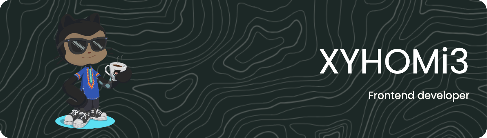

# 👋 Salut !



Je me nomme **Lucien**, mais tu peux m'appeler HOMi3. Je suis passionné par la création d'expériences utilisateur et je suis toujours à l'affût des dernières tendances pour optimiser les performances et la convivialité des interfaces web. Ma collaboration efficace avec des designers et des développeurs fait de moi un membre précieux de toute équipe de développement. Mon objectif est d'améliorer continuellement l'expérience en ligne des utilisateurs en créant des produits web innovants et performants.

---
<!--START_SECTION:waka-->


**Je suis un 🦉 de nuit** 

```text
🌞 Matin                  81 commits          █████░░░░░░░░░░░░░░░░░░░░   21.04 % 
🌆 Journée                101 commits         ███████░░░░░░░░░░░░░░░░░░   26.23 % 
🌃 Soirée                 101 commits         ███████░░░░░░░░░░░░░░░░░░   26.23 % 
🌙 Nuit                   102 commits         ███████░░░░░░░░░░░░░░░░░░   26.49 % 
```
📅 **Je suis le plus productif le Vendredi** 

```text
Lundi                    9 commits           █░░░░░░░░░░░░░░░░░░░░░░░░   02.34 % 
Mardi                    13 commits          █░░░░░░░░░░░░░░░░░░░░░░░░   03.38 % 
Mercredi                 56 commits          ████░░░░░░░░░░░░░░░░░░░░░   14.55 % 
Jeudi                    85 commits          ██████░░░░░░░░░░░░░░░░░░░   22.08 % 
Vendredi                 89 commits          ██████░░░░░░░░░░░░░░░░░░░   23.12 % 
Samedi                   89 commits          ██████░░░░░░░░░░░░░░░░░░░   23.12 % 
Dimanche                 44 commits          ███░░░░░░░░░░░░░░░░░░░░░░   11.43 % 
```


📊 **Cette semaine, je passe mon temps sur** 

```text
🕑︎ Fuseau horaire: Africa/Dakar

💬 Langages: 
TypeScript               4 hrs 3 mins        █████████░░░░░░░░░░░░░░░░   37.32 % 
CSS                      3 hrs 19 mins       ████████░░░░░░░░░░░░░░░░░   30.65 % 
JSON                     1 hr 8 mins         ███░░░░░░░░░░░░░░░░░░░░░░   10.49 % 
HTML                     36 mins             █░░░░░░░░░░░░░░░░░░░░░░░░   05.57 % 
Markdown                 21 mins             █░░░░░░░░░░░░░░░░░░░░░░░░   03.27 % 

🔥 Éditeurs de code: 
VS Code                  10 hrs 52 mins      █████████████████████████   100.00 % 

🐱‍💻 Projets: 
xyhomi3.github.io-1      4 hrs 6 mins        █████████░░░░░░░░░░░░░░░░   37.76 % 
phone-number-auth        2 hrs 12 mins       █████░░░░░░░░░░░░░░░░░░░░   20.27 % 
nomade-client            1 hr 59 mins        █████░░░░░░░░░░░░░░░░░░░░   18.32 % 
nomade-finance.github.io 52 mins             ██░░░░░░░░░░░░░░░░░░░░░░░   08.04 % 
react-firebase-phone-auth29 mins             █░░░░░░░░░░░░░░░░░░░░░░░░   04.51 % 

💻 Système d'exploitation: 
Mac                      10 hrs 52 mins      █████████████████████████   100.00 % 
```

**Je code principalement en CSS** 

```text
CSS                      3 repos             ████████░░░░░░░░░░░░░░░░░   33.33 % 
TypeScript               3 repos             ████████░░░░░░░░░░░░░░░░░   33.33 % 
JavaScript               2 repos             ██████░░░░░░░░░░░░░░░░░░░   22.22 % 
Python                   1 repo              ███░░░░░░░░░░░░░░░░░░░░░░   11.11 % 
```


 Last Updated on 24/09/2023 11:53:17 UTC
<!--END_SECTION:waka-->
---

## J'utilise ces technologies

<div align="left">
  
  
  
  
  
  
  
  
  
  
  
  
  
  
  
  
  
  
  
  
  
  
  
  
  
  
  
</div>


